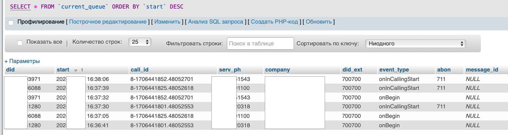

## Роботизация колл-центра на MySQL и Oracle  

| Задачи                   | Результаты |
| :-------------------- | :--------------------- |
| Снизить число клиентов, которым требуется соединение с оператором для получения необходимой информации.  | Создал DWH и ETL, витрины и дашборд на данных в ClickHouse

  Реализовал протоколирование звонков, определение по номерам и предыдущим звонкам звонящих 

 В зависимости от бизнес-логики, реализовал роботизированное проговаривание тех или сообщений, получение ответной реакции пользователей через голосовое меню |

## Реализация  

Краткое состояние сервиса (длина и состав очереди, компании-клиенты в очереди) постоянно отображается и актуализируется в служебной группе в Telegram.
При превышении определенного порога уведомляется ответственный сотрудник.

Ниже приведен пример содержания таблицы с данными текущей очереди звонков.

